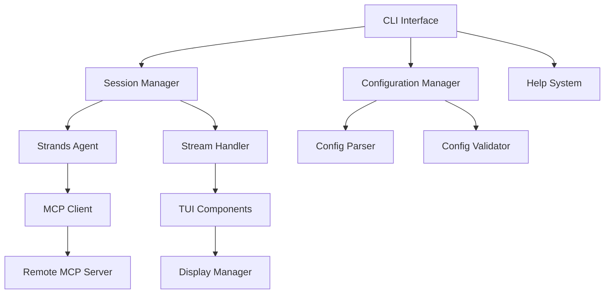

# Design Document

## Overview

EclairCP is a Python-based CLI tool that provides an elegant interface for testing and interacting with remote Model Context Protocol (MCP) servers. The tool leverages the Strands Agents SDK to create conversational interactions with MCP servers, featuring real-time streaming responses and session-based context management. The architecture emphasizes modularity, extensibility, and user experience through modern CLI/TUI libraries.

## Architecture

### High-Level Architecture



### Core Components

1. **CLI Interface Layer**: Entry point handling command-line arguments and routing
2. **Session Management**: Strands-powered conversational sessions with context retention
3. **MCP Integration**: Client for connecting to and interacting with MCP servers
4. **Configuration System**: File-based server specification and connection management
5. **Streaming Interface**: Real-time response display with elegant formatting
6. **Help System**: Comprehensive documentation and usage guidance

## Components and Interfaces

### 1. CLI Interface (`eclaircp.cli`)

**Purpose**: Main entry point and command-line argument processing

**Key Classes**:
- `CLIApp`: Main application controller
- `ArgumentParser`: Command-line argument handling

**Interfaces**:
```python
class CLIApp:
    def __init__(self):
        """Initialize the CLI application"""
        
    def run(self, args: List[str]) -> int:
        """Main entry point for CLI execution"""
        
    def show_help(self) -> None:
        """Display comprehensive help information"""
```

### 2. Configuration Manager (`eclaircp.config`)

**Purpose**: Handle MCP server specifications and connection details

**Key Classes**:
- `MCPServerConfig`: Individual server configuration
- `ConfigManager`: Configuration file management
- `ConfigValidator`: Validation and error handling

**Configuration File Format** (YAML):
```yaml
servers:
  aws-docs:
    command: "uvx"
    args: ["awslabs.aws-documentation-mcp-server@latest"]
    description: "AWS Documentation MCP Server"
    env:
      FASTMCP_LOG_LEVEL: "ERROR"
  
  github:
    command: "uvx"
    args: ["github-mcp-server"]
    description: "GitHub MCP Server"
    env:
      GITHUB_TOKEN: "${GITHUB_TOKEN}"
```

**Interfaces**:
```python
from pydantic import BaseModel, Field, validator
from typing import Dict, List, Optional

class MCPServerConfig(BaseModel):
    name: str
    command: str
    args: List[str]
    description: str = ""
    env: Dict[str, str] = Field(default_factory=dict)
    timeout: int = Field(default=30, ge=1, le=300)
    retry_attempts: int = Field(default=3, ge=1, le=10)
    
    @validator('command')
    def validate_command(cls, v):
        if not v.strip():
            raise ValueError('Command cannot be empty')
        return v.strip()
    
    @validator('args')
    def validate_args(cls, v):
        return [arg.strip() for arg in v if arg.strip()]

class ConfigManager:
    def load_config(self, path: str) -> ConfigFile:
        """Load and parse configuration file using Pydantic validation"""
        
    def save_config(self, config: ConfigFile, path: str) -> None:
        """Save configuration file with Pydantic serialization"""
        
    def validate_config(self, config_data: Dict) -> ConfigFile:
        """Validate configuration using Pydantic models"""
```

### 3. MCP Client (`eclaircp.mcp`)

**Purpose**: Handle connections and interactions with MCP servers

**Key Classes**:
- `MCPClientManager`: Manage MCP server connections
- `MCPToolProxy`: Proxy for MCP tools to integrate with Strands

**Interfaces**:
```python
class MCPClientManager:
    def connect(self, config: MCPServerConfig) -> bool:
        """Establish connection to MCP server"""
        
    def disconnect(self) -> None:
        """Close MCP server connection"""
        
    def list_tools(self) -> List[Dict]:
        """Get available tools from connected server"""
        
    def get_strands_tools(self) -> List[Callable]:
        """Convert MCP tools to Strands-compatible tools"""
```

### 4. Session Manager (`eclaircp.session`)

**Purpose**: Manage conversational sessions using Strands Agents

**Key Classes**:
- `SessionManager`: Handle session lifecycle and context
- `StreamingHandler`: Process and display streaming responses

**Interfaces**:
```python
class SessionManager:
    def __init__(self, mcp_client: MCPClientManager):
        """Initialize session with MCP client"""
        
    def start_session(self) -> None:
        """Begin interactive session"""
        
    def process_input(self, user_input: str) -> None:
        """Process user input through Strands agent"""
        
    def end_session(self) -> None:
        """Clean up session without persisting"""

class StreamingHandler:
    def handle_stream_event(self, event: Dict) -> None:
        """Process streaming events from Strands agent"""
```

### 5. TUI Components (`eclaircp.ui`)

**Purpose**: Elegant terminal user interface with streaming support

**Key Libraries**:
- `rich`: Advanced terminal formatting and display
- `textual`: Modern TUI framework for interactive elements
- `click`: Command-line interface creation

**Key Classes**:
- `StreamingDisplay`: Real-time response rendering
- `ServerSelector`: Interactive server selection interface
- `StatusDisplay`: Connection and operation status

**Interfaces**:
```python
class StreamingDisplay:
    def stream_text(self, text: str) -> None:
        """Display streaming text with formatting"""
        
    def show_tool_usage(self, tool_name: str, args: Dict) -> None:
        """Display tool execution information"""
        
    def show_error(self, error: str) -> None:
        """Display error messages with formatting"""

class ServerSelector:
    def select_server(self, servers: Dict[str, MCPServerConfig]) -> str:
        """Interactive server selection interface"""
```

## Data Models

### Configuration Models

```python
from pydantic import BaseModel, Field, validator
from typing import Dict, List, Optional, Any
from datetime import datetime
from enum import Enum

class MCPServerConfig(BaseModel):
    name: str
    command: str
    args: List[str]
    description: str = ""
    env: Dict[str, str] = Field(default_factory=dict)
    timeout: int = Field(default=30, ge=1, le=300)
    retry_attempts: int = Field(default=3, ge=1, le=10)
    
    @validator('command')
    def validate_command(cls, v):
        if not v.strip():
            raise ValueError('Command cannot be empty')
        return v.strip()
    
    @validator('args')
    def validate_args(cls, v):
        return [arg.strip() for arg in v if arg.strip()]

class SessionConfig(BaseModel):
    server_name: str
    model: str = "us.anthropic.claude-3-7-sonnet-20250219-v1:0"
    system_prompt: str = "You are a helpful assistant for testing MCP servers."
    max_context_length: int = Field(default=100000, ge=1000, le=1000000)
    
    @validator('server_name')
    def validate_server_name(cls, v):
        if not v.strip():
            raise ValueError('Server name cannot be empty')
        return v.strip()

class ConfigFile(BaseModel):
    servers: Dict[str, MCPServerConfig]
    default_session: Optional[SessionConfig] = None
    
    @validator('servers')
    def validate_servers(cls, v):
        if not v:
            raise ValueError('At least one server must be configured')
        return v
```

### Runtime Models

```python
class ConnectionStatus(BaseModel):
    server_name: str
    connected: bool
    connection_time: Optional[datetime] = None
    error_message: Optional[str] = None
    available_tools: List[str] = Field(default_factory=list)
    
    class Config:
        json_encoders = {
            datetime: lambda v: v.isoformat()
        }

class StreamEventType(str, Enum):
    TEXT = "text"
    TOOL_USE = "tool_use"
    ERROR = "error"
    COMPLETE = "complete"
    STATUS = "status"

class StreamEvent(BaseModel):
    event_type: StreamEventType
    data: Any
    timestamp: datetime = Field(default_factory=datetime.now)
    
    class Config:
        json_encoders = {
            datetime: lambda v: v.isoformat()
        }

class ToolInfo(BaseModel):
    name: str
    description: str
    parameters: Dict[str, Any] = Field(default_factory=dict)
    
    @validator('name')
    def validate_name(cls, v):
        if not v.strip():
            raise ValueError('Tool name cannot be empty')
        return v.strip()
```

## Error Handling

### Error Categories

1. **Configuration Errors**: Invalid YAML, missing required fields, invalid server specifications
2. **Connection Errors**: Failed MCP server connections, timeout issues, authentication failures
3. **Runtime Errors**: Strands agent errors, tool execution failures, streaming interruptions
4. **User Input Errors**: Invalid commands, malformed queries, unsupported operations

### Error Handling Strategy

```python
class EclairCPError(Exception):
    """Base exception for EclairCP"""
    pass

class ConfigurationError(EclairCPError):
    """Configuration-related errors"""
    pass

class ConnectionError(EclairCPError):
    """MCP server connection errors"""
    pass

class SessionError(EclairCPError):
    """Session management errors"""
    pass
```

### Error Display

- Use `rich` for formatted error messages with color coding
- Provide actionable suggestions for common errors
- Include troubleshooting tips in help output
- Log detailed error information for debugging

## Testing Strategy

### Unit Testing

- **Configuration Management**: Test YAML parsing, validation, and error handling
- **MCP Client**: Mock MCP server responses and test connection logic
- **Session Management**: Test Strands agent integration and streaming
- **CLI Interface**: Test argument parsing and command routing

### Integration Testing

- **End-to-End Workflows**: Test complete user journeys from CLI to MCP interaction
- **MCP Server Integration**: Test with real MCP servers (AWS docs, GitHub, etc.)
- **Streaming Performance**: Test response streaming under various conditions
- **Error Scenarios**: Test error handling and recovery mechanisms

### Testing Tools

```python
# pytest configuration
pytest_plugins = [
    "pytest-asyncio",
    "pytest-mock",
    "pytest-cov"
]

# Mock MCP server for testing
class MockMCPServer:
    def __init__(self, tools: List[Dict]):
        self.tools = tools
        
    def list_tools(self) -> List[Dict]:
        return self.tools
        
    def call_tool(self, name: str, args: Dict) -> Dict:
        # Mock tool execution
        pass
```

### Performance Testing

- **Streaming Latency**: Measure time-to-first-token and streaming performance
- **Memory Usage**: Monitor memory consumption during long sessions
- **Connection Overhead**: Test MCP server connection establishment time
- **Concurrent Sessions**: Test multiple simultaneous sessions (if supported)

## Implementation Considerations

### Dependencies

**Core Dependencies**:
- `strands-agents`: Strands Agents SDK for AI agent functionality
- `strands-agents-tools`: Additional tools for enhanced capabilities
- `mcp`: Model Context Protocol client library
- `pydantic`: Data validation and settings management
- `pyyaml`: Configuration file parsing
- `rich`: Terminal formatting and display
- `textual`: Modern TUI framework
- `click`: CLI framework
- `asyncio`: Asynchronous programming support

**Development Dependencies**:
- `pyink`: Code formatting
- `pylint`: Code linting
- `isort`: Import sorting
- `pytest`: Testing framework
- `pytest-asyncio`: Async testing support
- `pytest-mock`: Mocking utilities
- `pytest-cov`: Coverage reporting

### Packaging and Distribution

**Project Structure**:
```
eclaircp/
├── pyproject.toml
├── README.md
├── LICENSE
├── src/
│   └── eclaircp/
│       ├── __init__.py
│       ├── cli.py
│       ├── config.py
│       ├── mcp.py
│       ├── session.py
│       └── ui.py
├── tests/
│   ├── __init__.py
│   ├── test_cli.py
│   ├── test_config.py
│   ├── test_mcp.py
│   ├── test_session.py
│   └── test_ui.py
└── examples/
    ├── config.yaml
    └── README.md
```

**UV Configuration** (`pyproject.toml`):
```toml
[build-system]
requires = ["hatchling"]
build-backend = "hatchling.build"

[project]
name = "eclaircp"
version = "0.1.0"
description = "Elegant CLI for testing MCP servers"
authors = [{name = "Your Name", email = "your.email@example.com"}]
license = {text = "MIT"}
readme = "README.md"
requires-python = ">=3.9"
dependencies = [
    "strands-agents>=0.1.0",
    "strands-agents-tools>=0.1.0",
    "mcp>=1.0.0",
    "pydantic>=2.0.0",
    "pyyaml>=6.0",
    "rich>=13.0.0",
    "textual>=0.40.0",
    "click>=8.0.0",
]

[project.scripts]
eclaircp = "eclaircp.cli:main"

[tool.uv]
dev-dependencies = [
    "pyink>=1.0.0",
    "pylint>=3.0.0",
    "isort>=5.0.0",
    "pytest>=7.0.0",
    "pytest-asyncio>=0.21.0",
    "pytest-mock>=3.10.0",
    "pytest-cov>=4.0.0",
]
```

### Security Considerations

- **Environment Variable Handling**: Secure handling of sensitive environment variables in MCP server configurations
- **Command Execution**: Validate and sanitize MCP server command execution
- **Input Validation**: Sanitize user inputs to prevent injection attacks
- **Connection Security**: Ensure secure connections to remote MCP servers when applicable